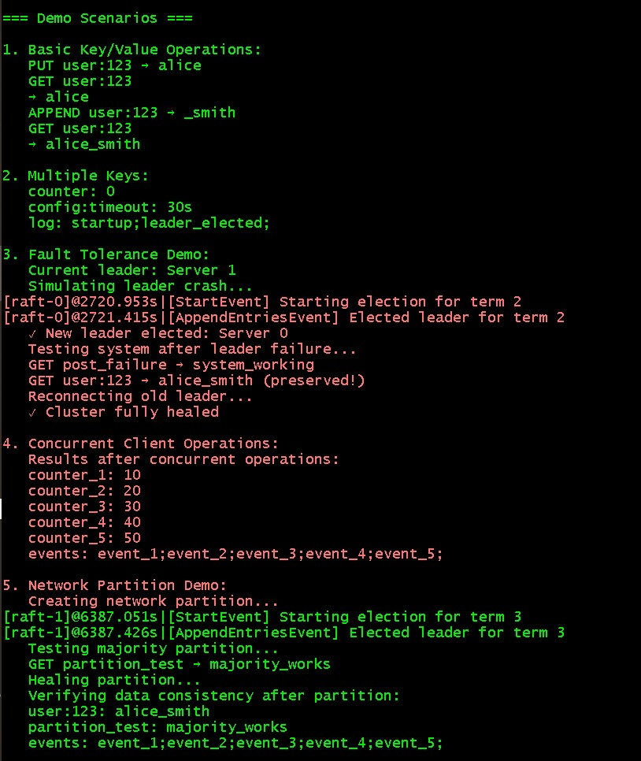

# Distributed, Fault-Tolerant Key/Value Store (Go + Raft)

A production-style, strongly consistent key/value datastore implemented in Go. The system achieves fault tolerance via state machine replication using the **Raft consensus algorithm**. It remains available for reads/writes as long as a majority of nodes are alive and connected, and it recovers automatically from crashes, restarts, and network partitions.

---

## Features

* Strong consistency — linearizable `Put`/`Get`/`Append` operations via a replicated log and single elected leader.
* Fault tolerance — survives crashes, restarts, and partitions; progress guaranteed when a majority can communicate.
* Crash recovery — consensus-critical state and logs are persisted (via a simulated persister) and restored on restart.
* Leader-driven replication — one leader orders all commands; followers catch up efficiently.
* Exactly-once semantics — duplicate suppression ensures client retries do not apply the same command twice.
* Optional verification — linearizability can be checked using [Porcupine](https://github.com/anishathalye/porcupine).

---

## Architecture

### KVServer

* Provides an RPC API: `Put(key, value)`, `Append(key, delta)`, `Get(key)`
* Applies committed Raft operations to a local `map[string]string`
* Tracks client request IDs for de-duplication

### Raft

* Runs inside each server process
* Leader election using randomized timeouts
* Log replication via `AppendEntries` RPCs
* Commit & apply once entries are stored on a majority
* Persists state (`currentTerm`, `votedFor`, log) for crash recovery
* Followers efficiently catch up via conflict-driven backtracking

### Client (Clerk)

* Discovers the current leader automatically
* Retries transparently on wrong-leader/timeouts
* Attaches `(ClientId, RequestId)` to each operation for duplicate suppression

### Communication

* All inter-server and client-server communication uses RPC (via simulated lossy/delayed network)
* No shared memory between nodes

---


## Repository Layout

```
raft/        # Raft consensus implementation
  raft.go      # Leader election, log replication, persistence
  persister.go # Simulated durable storage
  config.go    # Test harness support
  test_test.go # Raft tests

kvraft/      # KV server built on Raft
  server.go    # State machine, apply path, deduplication
  client.go    # Clerk (leader discovery, retries)
  common.go    # RPC types & errors
  config.go    # System test harness
  test_test.go # End-to-end tests
  models/kv.go # Porcupine linearizability model
```

---

## How to Run

### Prerequisites

* Go 1.20+
* Linux, macOS, or WSL

### Clone & Build

```bash
git clone <your-repo-url>
cd <repo-root>
```

### Run Tests

Full Raft + KV tests (recommended):

```bash
cd src/kvraft
go test -v
```

Just the Raft engine tests:

```bash
cd src/raft
go test -v
```

### Run the Demo

A simple demo program (`demo.go`) is also provided to showcase the system in action.
It spins up a 3-node Raft cluster, demonstrates leader election, key/value operations, fault tolerance, concurrent clients, and network partitions.

Run it from the repository root:

```bash
go run demo.go
```

You should see output walking through:

* Leader election
* Basic Put/Get/Append
* Multi-key operations
* Leader failure and automatic failover
* Concurrent clients updating data
* Network partition and healing
* Data consistency across the cluster


---

## Design Highlights

* Leader election — randomized timers prevent split votes; regular heartbeats maintain leadership
* Log replication — consistency checked with `(prevIndex, prevTerm)`; conflict backtracking speeds up catch-up
* Commit path — entries commit once replicated on a majority from current term
* Apply path — Raft emits `ApplyMsg` → KVServer updates state → wakes waiting RPCs
* Persistence — durable encoding of `currentTerm`, `votedFor`, log; restored on restart
* Client correctness — duplicate suppression with `(ClientId, RequestId)` ensures exactly-once semantics

---

## Acknowledgments

This implementation is based on the graduate-level distributed systems course (6.5840) at MIT, utilizing a provided harness for failure-injection and network simulation.
